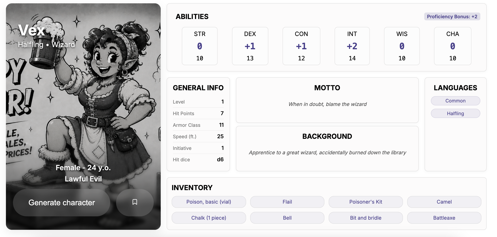

# DnD Character Generator

Random D&D 5e character generator. Generates a random character with race, class, alignment, abilities, inventory, motto, and background using the [D&D 5e API](https://www.dnd5eapi.co/).

## 🚀 Live Demo

👉 [https://dnd-character-generator-gules.vercel.app](https://dnd-character-generator-gules.vercel.app)

## 🛠 Tech Stack

- React 18 + Vite
- React Hooks (useState, useEffect, useLocalStorage)
- REST API (Promise.all, fetch)
- CSS Flexbox / Grid
- Responsive Design

## ✨ Features

- Generate random D&D character (race, class, alignment, abilities)
- Random inventory from 237 equipment items
- Character avatar based on race and gender
- Dynamic background for each race
- Save characters to localStorage
- Delete saved characters
- Responsive design (desktop / tablet / mobile)

## 📦 Getting Started

```bash
npm install
npm run dev
```

## 📸 Screenshot


